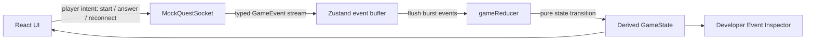
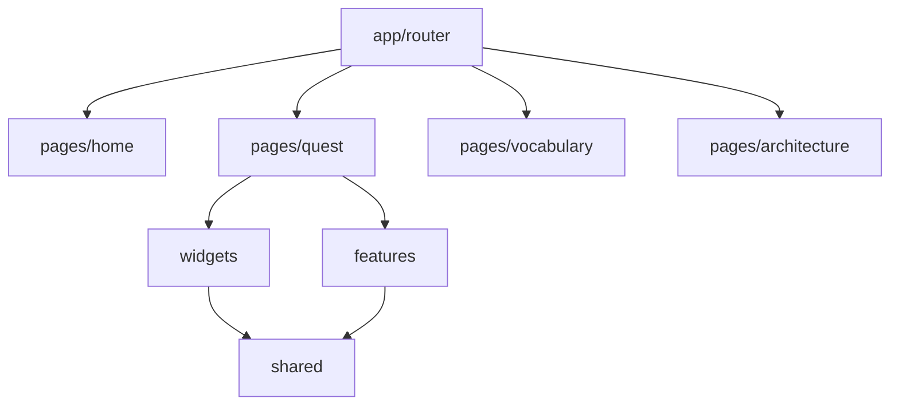

# DragonSpeak Architecture

DragonSpeak is a realtime gamified Mandarin learning platform built as a public frontend demo. The product scenario is intentionally small: a player enters a restaurant in Shanghai, talks to an NPC seller, answers in Mandarin, unlocks vocabulary, and watches realtime multiplayer-style events.

The implementation goal is to demonstrate Senior Frontend skills: typed event modeling, state isolation, modular UI boundaries, mock realtime infrastructure, debug tooling, testable business logic, and a polished interactive experience.

## Architecture Goals

- Keep quest progress event-driven instead of mutating state directly from UI.
- Make business logic testable outside React.
- Keep public demo code free of secrets, paid APIs, real AI, billing, or private backend details.
- Separate route-level pages, composed widgets, user actions, entities, and shared infrastructure.
- Provide a Developer Event Inspector so the event stream and derived state are visible during demos.
- Keep the 3D scene isolated and lazy-loaded so the main application does not pay the WebGL cost upfront.

## Repository Shape

```text
src/
  app/
    providers/              Zustand stores
    router/                 React Router configuration
  pages/                    Route-level screens
  widgets/                  Composed UI sections
  features/                 User-facing actions and controls
  entities/                 Domain data and models
  shared/
    api/mock-websocket/     Mock realtime transport
    game-engine/            Events, state, reducer, quest machine
    lib/                    Formatting and i18n helpers
```

## Runtime Flow



The UI does not directly modify quest progress. Components send intent to the mock socket, the socket emits typed events, and the reducer derives state.

## Event-Driven Quest Engine

Core files:

- `src/shared/game-engine/events.ts`
- `src/shared/game-engine/state.ts`
- `src/shared/game-engine/reducer.ts`
- `src/shared/game-engine/questMachine.ts`

The event contract models the domain:

```ts
type GameEvent =
  | { type: "QUEST_STARTED"; questId: string; timestamp: number }
  | { type: "NPC_MESSAGE"; npcId: string; text: string; pinyin: string; translation: string; timestamp: number }
  | { type: "CHOICES_SHOWN"; questionId: string; choices: Choice[]; timestamp: number }
  | { type: "PLAYER_ANSWERED"; playerId: string; answerId: string; correct: boolean; timestamp: number }
  | { type: "SCORE_UPDATED"; playerId: string; score: number; timestamp: number }
  | { type: "WORD_UNLOCKED"; wordId: string; hanzi: string; pinyin: string; meaning: string; timestamp: number }
  | { type: "LEADERBOARD_UPDATED"; players: PlayerScore[]; timestamp: number }
  | { type: "QUEST_COMPLETED"; questId: string; reward: Reward; timestamp: number };
```

This makes the frontend easy to reason about:

- Events are serializable.
- State transitions are pure.
- Tests can cover reducer behavior without rendering React.
- The same event contract can later be backed by a production server.

## Mock WebSocket Layer

`src/shared/api/mock-websocket/mockQuestSocket.ts` simulates server behavior:

- connection lifecycle
- reconnect simulation
- latency updates
- quest start
- NPC messages
- answer choices
- fake player answers
- leaderboard updates
- quest completion
- burst delivery through an event buffer

The mock keeps the public repository self-contained. No external API keys or paid services are required.

## Zustand Store

`src/app/providers/gameStore.ts` owns the client-side integration layer:

- subscribes to mock socket events
- buffers incoming events
- flushes bursts into the reducer
- exposes connection status and latency
- exposes user intents such as `startQuest`, `answer`, `reconnect`, and `reset`

The store is intentionally thin. It coordinates infrastructure, while the game reducer owns domain state transitions.

## Developer Event Inspector

`src/widgets/dev-event-inspector/DevEventInspector.tsx` is a portfolio-focused debugging feature. It shows:

- event stream
- current derived game state
- connection status
- latency
- buffer size
- last 20 events

This is useful for interviews because it makes invisible realtime behavior visible.

## UI Composition



The frontend follows a Feature-Sliced-inspired layout:

- `pages` define route-level screens.
- `widgets` compose meaningful UI blocks such as quest scene, leaderboard, and event inspector.
- `features` hold user actions such as answer choices, realtime controls, and language switcher.
- `entities` contain domain data models.
- `shared` contains reusable infrastructure and domain engine code.

## 3D Scene

`src/widgets/quest-scene/RestaurantThreeScene.tsx` implements a lightweight interactive Three.js restaurant scene:

- lazy-loaded with `React.lazy`
- isolated from quest business logic
- resizes with the container
- cleans up WebGL resources on unmount
- responds to pointer movement
- uses `preserveDrawingBuffer` to support screenshot and pixel checks in automated QA

The 3D scene adds portfolio-level interactivity while staying separate from the event-driven quest engine.

## Localization

DragonSpeak supports English and Russian UI text through:

- `src/app/providers/languageStore.ts`
- `src/features/language-switcher/LanguageSwitcher.tsx`
- `src/shared/lib/i18n.ts`

This public demo uses a typed dictionary instead of a full i18n framework. That keeps the implementation readable while preserving a clear migration path to `i18next` or another translation workflow in a larger product.

## Public Demo vs Commercial Version

Public demo:

- mock WebSocket
- deterministic NPC events
- fake online players
- no external secrets
- no real AI
- no billing
- no production backend

Commercial version could replace mocks behind the same event contract:

- real multiplayer transport
- persistent user progress
- AI-assisted dialogue generation
- speech recognition and pronunciation scoring
- account system
- billing and subscriptions
- admin and content tooling

## Testing Strategy

The current tests focus on business logic:

- quest reducer
- score updates
- word unlocking
- event handling

The reducer is pure, so it can be tested without a browser. The 3D scene was manually verified with Playwright-based canvas checks during implementation.

## Interview Talking Points

- Why event-driven state makes realtime UI easier to debug.
- Why UI sends intent instead of mutating quest state directly.
- How buffering protects rendering during event bursts.
- How a mock WebSocket can mirror production contracts.
- Why the Developer Event Inspector improves QA and stakeholder demos.
- How lazy-loading isolates the cost of Three.js.
- How public and private repositories can share a base architecture while keeping commercial code private.
