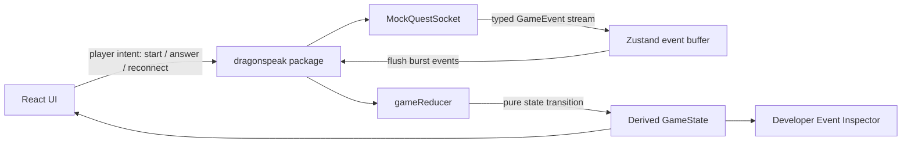
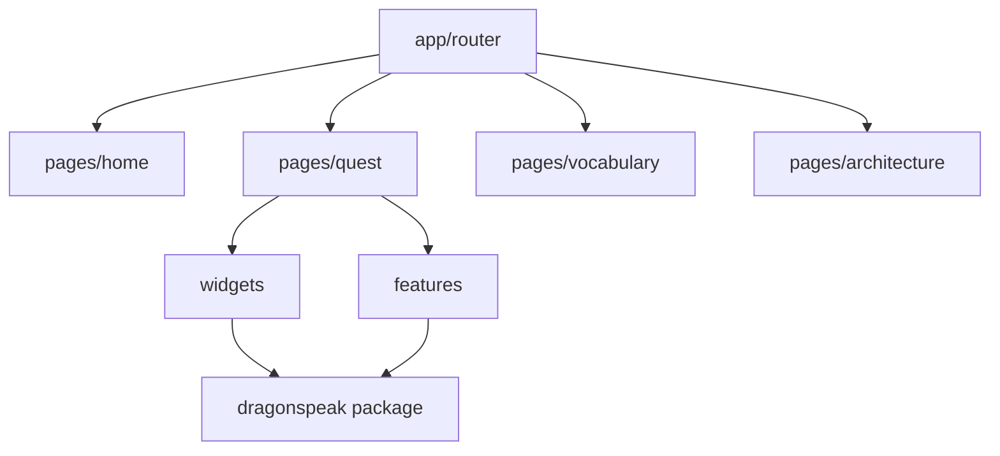

# Архитектура DragonSpeak

DragonSpeak — это realtime-платформа для изучения Mandarin Chinese в игровом формате, собранная как публичная frontend demo. Сценарий специально небольшой: игрок заходит в ресторан в Шанхае, разговаривает с NPC-продавцом, отвечает на китайском, открывает слова и видит realtime-события в стиле multiplayer.

Цель реализации — показать уровень Senior Frontend: типизированную модель событий, изоляцию состояния, модульные границы UI, mock realtime-инфраструктуру, debug tooling, тестируемую бизнес-логику и интерактивный интерфейс.

## Цели Архитектуры

- Управлять прогрессом квеста через события, а не через прямую мутацию из UI.
- Сделать бизнес-логику тестируемой без React.
- Держать публичную demo без секретов, платных API, реального AI, платежей и приватного backend.
- Разделить route-level страницы, составные widgets, user actions, entities и shared-инфраструктуру.
- Добавить Developer Event Inspector, чтобы event stream и derived state были видны во время демо.
- Изолировать и lazy-load 3D сцену, чтобы основное приложение не загружало WebGL заранее.

## Структура Репозитория

```text
DragonSpeak-demo/
  src/
    app/                    React Router и Zustand integration
    pages/                  Route-level screens
    widgets/                Составные UI-секции
    features/               Пользовательские действия и controls
    entities/               App-level view models
  node_modules/dragonspeak  Symlink на ../DragonSpeak/packages/dragonspeak

DragonSpeak/
  packages/dragonspeak/src/
    events.ts               Typed GameEvent contract
    state.ts                GameState и initial state
    reducer.ts              Pure event -> state reducer
    questMachine.ts         Shanghai restaurant quest machine
    mockQuestSocket.ts      Mock realtime transport
    i18n.ts                 EN/RU dictionaries
    registry.ts             questId -> lazy 3D scene loader
    RestaurantThreeScene.tsx
    DragonSeller.ts         Вынесенная 3D модель продавца
```

## Runtime Flow



UI не меняет прогресс квеста напрямую. Компоненты отправляют намерение игрока в mock socket, socket эмитит типизированные события, а reducer выводит новое состояние.

## Event-Driven Quest Engine

Ключевые файлы:

- `../DragonSpeak/packages/dragonspeak/src/events.ts`
- `../DragonSpeak/packages/dragonspeak/src/state.ts`
- `../DragonSpeak/packages/dragonspeak/src/reducer.ts`
- `../DragonSpeak/packages/dragonspeak/src/questMachine.ts`

Event contract описывает домен:

```ts
type GameEvent =
  | { type: "QUEST_STARTED"; questId: string; timestamp: number }
  | {
      type: "NPC_MESSAGE";
      npcId: string;
      text: string;
      pinyin: string;
      translation: string;
      timestamp: number;
    }
  | { type: "CHOICES_SHOWN"; questionId: string; choices: Choice[]; timestamp: number }
  | {
      type: "PLAYER_ANSWERED";
      playerId: string;
      answerId: string;
      correct: boolean;
      timestamp: number;
    }
  | { type: "SCORE_UPDATED"; playerId: string; score: number; timestamp: number }
  | {
      type: "WORD_UNLOCKED";
      wordId: string;
      hanzi: string;
      pinyin: string;
      meaning: string;
      timestamp: number;
    }
  | { type: "LEADERBOARD_UPDATED"; players: PlayerScore[]; timestamp: number }
  | { type: "QUEST_COMPLETED"; questId: string; reward: Reward; timestamp: number };
```

Такой подход упрощает поддержку:

- события сериализуемые;
- state transitions чистые;
- reducer можно тестировать без React;
- тот же event contract можно позже подключить к production backend.

## Mock WebSocket Layer

`../DragonSpeak/packages/dragonspeak/src/mockQuestSocket.ts` симулирует server behavior:

- connection lifecycle;
- reconnect simulation;
- latency updates;
- старт квеста;
- NPC messages;
- answer choices;
- ответы fake players;
- leaderboard updates;
- завершение квеста;
- burst delivery через event buffer.

Mock делает публичный репозиторий самодостаточным. Для запуска не нужны внешние API keys или платные сервисы.

## Zustand Store

`src/app/providers/gameStore.ts` отвечает за client-side integration layer:

- подписка на mock socket events;
- буферизация входящих событий;
- flush burst events в reducer;
- connection status и latency;
- пользовательские intent methods: `startQuest`, `answer`, `reconnect`, `reset`.

Store специально остается тонким. Он координирует инфраструктуру, а domain state transitions живут в game reducer.

## Developer Event Inspector

`src/widgets/dev-event-inspector/DevEventInspector.tsx` — portfolio-focused debugging feature. Он показывает:

- event stream;
- текущее derived game state;
- connection status;
- latency;
- buffer size;
- последние 20 events.

На интервью это полезно, потому что делает realtime-поведение видимым и объяснимым.

## UI Composition



Frontend близок к Feature-Sliced-style структуре:

- `pages` описывают route-level screens.
- `widgets` собирают крупные UI-блоки: quest scene, leaderboard, event inspector.
- `features` содержат пользовательские действия: answer choices, realtime controls, language switcher.
- `entities` хранят app-level view models.
- пакет `dragonspeak` содержит reusable infrastructure, dictionaries, domain engine, mock socket и registry для 3D scenes.

## 3D Scene

Приложение использует `getSceneLoader` из `dragonspeak`. Shared package lazy-loads `RestaurantThreeScene.tsx`, а dragon NPC seller вынесен в `DragonSeller.ts`:

- lazy-loaded через `React.lazy`;
- изолирована от бизнес-логики квеста;
- resize по контейнеру;
- cleanup WebGL resources при unmount;
- реакция на pointer movement;
- `preserveDrawingBuffer` для screenshot и pixel checks в automated QA.

3D сцена добавляет интерактивность для portfolio, но не смешивается с event-driven quest engine.

## Локализация

DragonSpeak поддерживает English и Russian UI text через:

- `src/app/providers/languageStore.ts`
- `src/features/language-switcher/LanguageSwitcher.tsx`
- `../DragonSpeak/packages/dragonspeak/src/i18n.ts`

В публичной demo используется typed dictionary вместо большого i18n framework. Это проще читать, но оставляет понятный путь миграции на `i18next` или другой translation workflow.

## Public Demo vs Commercial Version

Публичная demo:

- mock WebSocket;
- deterministic NPC events;
- fake online players;
- без external secrets;
- без real AI;
- без billing;
- без production backend.

Коммерческая версия может заменить mocks за тем же event contract:

- real multiplayer transport;
- persistent user progress;
- AI-assisted dialogue generation;
- speech recognition и pronunciation scoring;
- account system;
- billing and subscriptions;
- admin и content tooling.

## Testing Strategy

Текущие тесты покрывают business logic:

- quest reducer;
- score updates;
- word unlocking;
- event handling.

Reducer чистый, поэтому тестируется без браузера. 3D сцена во время реализации проверялась Playwright-based canvas checks.

## Interview Talking Points

- Почему event-driven state упрощает debugging realtime UI.
- Почему UI отправляет intent, а не мутирует quest state напрямую.
- Как buffering помогает при burst events.
- Как mock WebSocket повторяет production contracts.
- Почему Developer Event Inspector полезен для QA и stakeholder demos.
- Как lazy-loading изолирует стоимость Three.js.
- Как public/private repositories могут разделять base architecture, не раскрывая commercial code.
